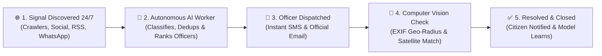

# CivicConnect Autonomous - Self-Operating Civic Intelligence Platform

> **Tagline:** *"It doesn't wait for data. It finds it. It doesn't wait for orders. It acts. It doesn't wait for humans. It learns."*

[](https://civic-con-nect.vercel.app)
[](https://github.com/ritikkalal07/water-map-now)
[](https://civic-con-nect.vercel.app)
[](https://civic-con-nect.vercel.app)
[](LICENSE)

---

## 🏆 HackDevengers 2.0 Open-Source Hackathon Submission

**CivicConnect Autonomous** is India's first self-operating municipal intelligence platform for Urban Local Bodies (ULBs) and citizens. 

Traditional civic 311 portals require citizens to fill out tedious forms and wait weeks for manual processing. **CivicConnect Autonomous continuously scans public data 24/7**, auto-detects civic hazards (potholes, garbage dumps, water main breaks), routes complaints to responsible officers using machine learning, verifies resolution photos via computer vision, and escalates unresolved tickets automatically.

---

## ⚡ 10-Second Quick Summary: How It Works



---

## 🎯 Simple Step-by-Step Use Cases

### 1. For Citizens (0 Effort, 1-Click Platform)
- **Report an Issue in 5 Seconds:** Click "Report Issue" or tell the 24/7 Assistant (e.g. *"Water main leaking on main road"*).
- **Instant 1-Click Multilingual Switcher:** Select any language (**English, हिंदी, ಕನ್ನಡ, தமிழ், తెలుగు, मराठी, ગુજરાતી, বাংলা, മലയാളം, ਪੰਜਾਬੀ**) and the entire platform UI updates instantly.
- **Real-Time Ticket Tracking:** Enter ticket ID `#CVC-1082` to view step-by-step resolution progress, assigned engineer name, contact details, and before/after verification photos.

### 2. For Municipal Officers & Engineers
- **Zero Manual Data Entry:** Receive automated dispatches with precise GPS coordinates, auto-classified issue severity, and SLA deadline timers.
- **1-Tap Photo Proof Upload:** Upload resolution photos directly from field devices. The AI Verifier checks EXIF location match (<200m radius) and photo authenticity instantly.

### 3. For Zonal Commissioners & ULB Leadership
- **Proactive Hazard Spike Alerts:** System detects abnormal spikes (>3x baseline) in ward complaints and alerts leadership before public outrage occurs.
- **Zero SLA Breaches:** Tickets approaching SLA limits are auto-escalated to Executive Engineers and Zonal Commissioners automatically.

---

## 📊 Traditional 311 vs. CivicConnect Autonomous

| Feature | Traditional 311 System | CivicConnect Autonomous |
|---|---|---|
| **Data Ingestion** | Manual form entry by citizens | **24/7 Autonomous Harvesters** (Crawlers, Social, RSS, Satellite, WhatsApp, IVR) |
| **Language Support** | Single language (English/Local) | **22 Indian Languages** powered by Bhashini NMT & ASR with 1-click UI toggle |
| **Complaint Routing** | Static manual assignment | **ML Router Worker** (Ranks officers by success rate, SLA history & current load) |
| **SLA Enforcement** | Manual supervisor check | **Autonomous Escalator Worker** (Auto-escalates to Level 1 → 2 → 3) |
| **Fix Verification** | Physical manual site inspection | **Computer Vision & EXIF Geo-Radius** verification (<200m radius) |
| **System Uptime** | Halts when external API fails | **Self-Heal Worker** (Switches instantly to backup scrapers) |
| **Deployment Cost** | High infrastructure costs | **100% Zero-Cost Compatibility** (Vercel Free Tier + Resilient Failovers) |

---

## 🏗 System Architecture & 4 Core Layers

```text
+-----------------------------------------------------------------------------------+
|                        CIVICCONNECT AUTONOMOUS PLATFORM                           |
+-----------------------------------------------------------------------------------+
                                          |
  LAYER 1: 10 AUTONOMOUS HARVESTERS (24/7 Ingest)
  [ Web Crawler ]  [ Social Listener ]  [ RSS Watcher ]  [ PDF/Doc OCR ] [ Gov API ]
  [ Open311 API ]  [ RTI Watcher     ]  [ Satellite   ]  [ WhatsApp    ] [ Voice IVR ]
                                          |
                                          v
  LAYER 2: SELF-BUILDING KNOWLEDGE GRAPH
  14,820 Nodes & 42,100 Edges (Wards -> Officers -> Departments -> SLAs -> Reliability)
                                          |
                                          v
  LAYER 3: 9 SPECIALIZED AUTONOMOUS WORKERS
  [ Router ] [ Escalator ] [ Verifier ] [ Detector ] [ Anomaly ] [ Dedup ] [ Assistant ] [ Sentiment ] [ SelfHeal ]
                                          |
                                          v
  LAYER 4: 5 CONTINUOUS LEARNING LOOPS
  [ Loop 1: Routing Precision ]   [ Loop 2: Issue Classification ]  [ Loop 3: SLA Prediction ]
  [ Loop 4: Auto-Prompt Tuning]   [ Loop 5: Harvester Reliability Scoring ]
                                          |
                                          v
  ACTION OUTPUT: Officer Portal * SMS * Email * WhatsApp * Open311 Sync * Live Safety Map
+-----------------------------------------------------------------------------------+
```

---

## 🤖 9 Autonomous Workers Explained

1. **Router Worker:** Calculates optimal officer match score: `(success_rate * 0.4 + (1 / (1 + avg_hours)) * 0.3 + (1 / (1 + load)) * 0.2 + lang_match * 0.1)`.
2. **Escalator Worker:** Auto-escalates overdue tickets past SLA deadline to Zonal Commissioners.
3. **Verifier Worker:** Computer vision + Geo-EXIF radius verification (<200m) for before/after fix photos.
4. **Detector Worker:** Parses public streams and auto-files complaints when confidence >85%.
5. **Anomaly Worker:** Detects >3x baseline complaint spikes in wards and triggers urgent alerts.
6. **Dedup Worker:** Merges duplicate reports within 100m radius & 7-day window.
7. **Assistant Worker:** 24/7 conversational support in 22 Indian languages via Bhashini.
8. **Sentiment Worker:** Detects hazard keywords (*electric shock, drowning, gas leak, collapse*) for instant priority boost (+50).
9. **SelfHeal Worker:** Swaps failed API endpoints to secondary web scrapers for zero downtime.

---

## 🛠 Tech Stack

- **Frontend:** React 19, TanStack Start, TypeScript, Vite, Tailwind CSS, Leaflet Maps.
- **Backend & SSR:** TanStack Start SSR Engine + Nitro Server.
- **Database & Resilient Layer:** Vercel Postgres (PostgreSQL 15 + PostGIS) + In-Memory Fallback Store ($0 Cost).
- **AI & NLP:** Government of India Bhashini NMT & ASR API Integration.
- **Deployment:** Vercel Edge Network (`https://civic-con-nect.vercel.app`).

---

## 🚀 Local Quick Start & Automated Verification

### Prerequisites
- Node.js 20+ installed
- Git installed

### 1. Clone & Install
```bash
git clone https://github.com/ritikkalal07/water-map-now.git
cd water-map-now
npm install
```

### 2. Run Unit Tests (17/17 Passing)
```bash
npm test
```

### 3. Production Build Test
```bash
npm run build
```

### 4. Start Local Development Server
```bash
npm run dev
```

---

## 🤝 Open-Source & License

Distributed under the **MIT License**. Open for municipal governance adoption across all Indian Urban Local Bodies. Built with ❤️ for **HackDevengers 2.0**.
